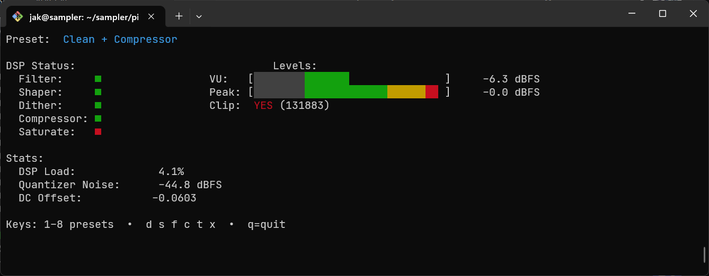

# Amiga Digital Sampler

S/PDIF to parallel-port sampler interface for Amiga.

## Overview

This project provides fully **digital** audio sampling for the Amiga using:
- Raspberry Pi for S/PDIF capture and DSP
- Raspberry Pi Pico for cycle-accurate parallel output
- Amiga sampling software (e.g., ProTracker)

The result is a modern, clean, high-quality digital sampler that plugs directly into the Amiga's parallel port.

## Status

1.3 – New DSP engine, real-time UI, presets, shaping, filtering, compression, saturation, and dither



The sampler has a terminal UI with:
- real-time VU / peak meters
- clip detection
- DSP load meter
- quantizer noise meter
- DC offset monitor
- runtime DSP toggles
- eight presets

The sampler supports multiple DSP modes suitable for different content types:

- **Raw / punchy**: filter off, shaping off
- **Clean / pads**: shaping on (auto-filter on)
- **Bright transients / snares**: filter off, shaping off
- **Lo-fi / crunchy**: shaping on, filter off (intentional aliasing)

## Motivation

Traditional analog Amiga parallel-port samplers are noisy, have DC offsets, and dynamics issues.
Rather than fight the hardware, this project implements a **fully digital** sampler:

S/PDIF → Raspberry Pi → DSP → Pico → Amiga DB25

No noise, no DC offsets, and precise sample rate control.

### UI Display

The UI includes:

* **VU meter** (grey → green → yellow → red)
* **Peak meter**
* **Clip indicator & event counter**
* **DSP load** (real-time load)
* **Quantizer noise (oversampled quantizer error energy)**
* **DC offset**

## Hardware

### Required Components

- Raspberry Pi 3A+ or 4
- HiFiBerry Digi+ I/O
- Raspberry Pi Pico
- 74HCT245 octal buffer
- 74LVX14 Schmitt trigger inverter
- DB25 male connector
- 0.1µF ceramic capacitors (3×)
  - Rails
  - 74HCT245 decoupling
  - 74LVX14 decoupling

### Connections

#### SPI (Pi → Pico)
```
Pi GPIO 10 (MOSI)  →  Pico GP16
Pi GPIO 11 (SCLK)  →  Pico GP18
Pi GPIO 8  (CE0)   →  Pico GP17
GND                →  GND
```

#### STROBE (from Amiga → Pico via 74LVX14)
```
74LVX14 Pin 1  IN   →  DB25 Pin 1 (STROBE)
74LVX14 Pin 2  OUT  →  Pico GP10
Pin 14 → 3.3V
Pin 7  → GND
0.1µF across VCC/GND
```

#### Sampling Activity (Pico → Pi)
```
Pico GP20  →  Pi GPIO 5
```
The Pico drives this pin HIGH while actively receiving STROBE pulses from the Amiga, LOW when idle. The Pi monitors this to run hook scripts (`sampler_active.sh` / `sampler_inactive.sh`) for automation (e.g., muting DAW returns to prevent feedback).

#### Data Buffer (Pico → Amiga via 74HCT245)
```
74HCT245 Pins 2–9   ←  Pico GP2–9
74HCT245 Pins 11–18 →  DB25 Pins 2–9
DIR → 5V
OE  → Pico GP11
VCC → 5V, GND → GND
0.1µF across VCC/GND
````

**IMPORTANT:** All devices including the Amiga must share ground.

## Software

### Raspberry Pi

```bash
cd pi
make
./sampler
````

Use the keyboard to enable DSP sections or change presets (1-8).

### Runtime Controls (Keyboard)

**Presets (1–8):**

* Raw
* Raw + Saturation
* Filter Only
* Shaper
* Shaper + Dither
* Dirty LoFi
* Comp + Sat
* Clean + Compressor

**DSP Toggles:**

```
f  = toggle filter
s  = toggle shaper
d  = toggle dither
c  = toggle compressor
t  = toggle saturator
x  = reset peak + clip counters
q  = quit
```

### Command-line Options

```
--gain X       Input gain (default 1.0)
--rate Hz      Target sample rate (default 28149.96)
--test-tone    Generate sine wave
--tone-freq Hz Frequency of sine (default 1000 Hz)
--test-ramp    Generate test ramp
```

### Pico

```bash
cd pico
mkdir build && cd build
cmake ..
make
# Copy pico_amiga_sampler.uf2 to the Pico in BOOTSEL mode
```

## ProTracker Setup

1. Set sampling note to **A-3**
2. After sampling, set **Finetune +1** for exact pitch

This matches the Amiga's 28149.96 Hz sampling mode for PT A-3.

## Technical Details

### DSP Signal Path (with options)

```
48kHz S/PDIF input
↓
DC-block (always)
↓
Pre-FIR LPF (optional: filter)
↓
Compressor (optional)
↓
Saturator (optional)
↓
Oversample quantizer at 48kHz (always)
  • 3rd-order shaping (optional)
  • HP-TPDF dither (optional)
↓
Post-FIR LPF (optional: filter)
↓
Decimation to ~28.15kHz (always)
↓
Final 8-bit quantizer (always)
  • 2nd-order shaping (optional)
↓
SPI burst output → Pico
↓
PIO-driven parallel bus → Amiga
```

### Notes on DSP Behavior

* **Oversampling is always active**, ensuring stable, artifact-free decimation
* **Shaping automatically enables filtering** when enabled via preset
* Disabling filters is ideal for snares/kicks
* Enabling shaping + filtering is ideal for pads/melodic sounds
* Shaping without filtering produces aliasing (intentional LoFi mode)
* Toggle DSP sections on/off in UI and monitor DSP state

### Timing

* Amiga STROBE ≈ **28149.96 Hz**
* Pico latches the sample exactly on each STROBE edge
* Pi → Pico SPI transfer uses small bursts to minimize latency
* 8KB ringbuffer smooths jitter

## Warning

Be careful, don't break your Amiga! Check wiring twice. Ensure common ground.
Only drive DB25 **D0–D7** pins — nothing else.

## Acknowledgements

* Thanks to **echolevel** for Open Amiga Sampler
* Thanks to **8bitbubsy** for help debugging ProTracker timing

## License

MIT
